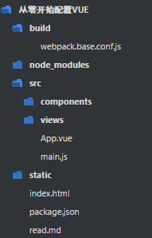

# From now on

## Vue-cli
### install
```
1.npm install -g vue-cli
2.vue init webpack [project-name]
3.npm install
4.npm install vuex jquery less less-loader --save-dev
```
### config
```
1.main.js import引入第三方组件或库，例如bootstrap
  import * from 'bootstrap.min.css'
2.全局配置jquery
--------build/webpack.base.conf.js---------
plugins: [
    new webpack.ProvidePlugin({
        jQuery: "jquery",
        $: "jquery"
    })
]
3.决定打包后是绝对路径还是相对路径
----------config/index.js-----------------
assetsPublicPath: './'
```

## install by self
### 1.Make dir > Install devDependencies
> 搭建项目目录结构，安装依赖性
```
1.npm init -> create package.json
2.npm install vue webpack webpack-dev-server vue-loader vue-html-loader css-loader vue-style-loader vue-hot-reload-api babel-loader babel-core babel-plugin-transform-runtime babel-preset-es2015 babel-runtime@5 html-webpack-plugin vue-template-compiler vue-roter vuex less less-loader axios --save-dev
3.make dir
```


### 2.Configuration webpack
> 配置webpack
```
1. 根目录下创建 build>webpack.base.conf.js
-------------webpack.base.conf.js---------------
'use strict';
const path = require('path');
const HtmlWebpackPlugin = require('html-webpack-plugin');
function resolve (dir) {
  return path.join(__dirname, '..', dir)
}
module.exports = {
  entry: {
    app: [
      path.resolve(__dirname, '../src/main.js')
    ] 
  },
  output: {
    path: path.resolve(__dirname, '../dist/static'),
    filename: '[name].[hash:8].js',
    publicPath: 'static/'
  },
  resolve: {
    extensions: ['.js', '.vue'],
    alias: {
      'vue$': 'vue/dist/vue.esm.js',
      '@': resolve('src')
    }
  },
  module: {
   rules: [
    {
      test: /\.vue$/,
      loader: 'vue-loader'
    },
    {
      test: /\.js$/,
      loader: 'babel-loader?presets=es2015',
      exclude: '/node_modules/'
    }
   ]
  },
  plugins: [
    new HtmlWebpackPlugin({
      filename: '../index.html',
      template: path.resolve(__dirname, '../index.html')
    })
  ]
};
2.创建入口文件及主Vue
----------------App.vue--------------------
<template>
  <div id="app">
    <h1>hello vue</h1>
  </div>
</template>
<script>
export default {
  name: 'app'
}
</script>
<style lang="css">
</style>
-------------------main.js----------------------------------
import Vue from 'vue'
import App from './App'
new Vue({
  el: '#app',
  template: '<App/>',
  components: {App}
})
************************************************************
3.打包: webpack --config build/webpack.base.conf.js
```

### 3.Real time compilation file 
> 实时编译文件
```
1.npm install webpack-dev-middleware express --save-dev
2.build > dev-server.js
------------dev-server.js-----------------
//引入的依赖模块
var express = require('express');
var webpack = require('webpack');
var config = require('./webpack.base.conf');
var port = 8888;
//创建一个express实例
var app = express();
var compiler = webpack(config);
var devMiddleware = require('webpack-dev-middleware')(compiler, {
    publicPath: config.output.publicPath,
    stats: {
        color: true,
        chunks: false
    }
});
app.use(devMiddleware);
app.listen(port, function(err){
    if(err){
        console.log(err);
        return;
    }
    console.log('listening at http://localhost:' + port);
});
3.执行命令，启动端口
cmd: node build/dev-server.js
浏览器: http://localhost:8888/
//发生错误，需要修改base中的output.publicPath:'/',plugins中HtmlWebpackPlugin。filename:'index.html'
//在实际开发中尽量不要修改基本配置，这样可以引入一个中间配置文件webpack.dev.conf.js来修改基本配置项，从而让dev-server来决定引入哪个配置文件
------------------webpack.dev.conf.js---------------------------
var HtmlWebpackPlugin = require('html-webpack-plugin');
var path = require('path');
//引入基本配置
var config = require('./webpack.base.conf.js');
//修改基本配置
config.output.publicPath = '/';
config.plugins = [
    new HtmlWebpackPlugin({
      filename: 'index.html',
      template: path.resolve(__dirname, '../index.html'),
      inject: true
    })
];
module.exports = config;
--------------------修改dev-server.js---------------------------
var config = require('./webpack.dev.conf');
//这样代码修改后，webpack自动打包发布，不过浏览器需要手动刷新
```

### Hot reload > Auto refresh browser 
> 热加载，自动刷新浏览器
```
1.npm install webpack-hot-middleware --save-dev
2.修改dev-server.js
---------------在dev-server.js中添加内容---------------------------
var hotMiddleware = require('webpack-hot-middleware')(compiler);
app.use(hotMiddleware);
3.修改webpack.dev.conf.js
--------------在webpack.dev.conf.js中添加内容------------
var webpack = require('webpack');
config.plugins = [
    new webpack.optimize.OccurrenceOrderPlugin(),
    new webpack.HotModuleReplacementPlugin(),
    new webpack.NoEmitOnErrorsPlugin(),
    new HtmlWebpackPlugin({
      filename: 'index.html',
      template: path.resolve(__dirname, '../index.html'),
      inject: true
    })
];
var devClient = 'webpack-hot-middleware/client';
Object.keys(config.entry).forEach(function(name,i){
    var extress = [devClient];
    config.entry[name] = extress.concat(config.entry[name]);
});
4.启动dev-server
```

### Listen html change
> 监听HTML文件变化[有问题，待续]

### 简化webpack命令
```
1.修改package.json
"scripts": {
    "dev": "node build/dev-server.js",
    "build": "webpack --config build/webpack.base.conf.js"
},
2.执行命令
启动开发环境: npm run dev
打包源代码:  npm run build
```
